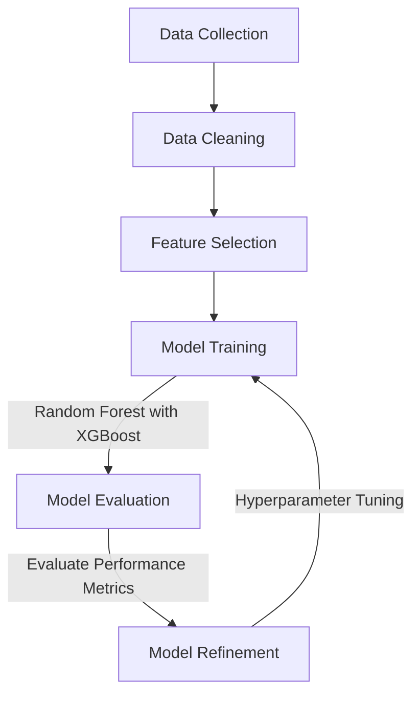
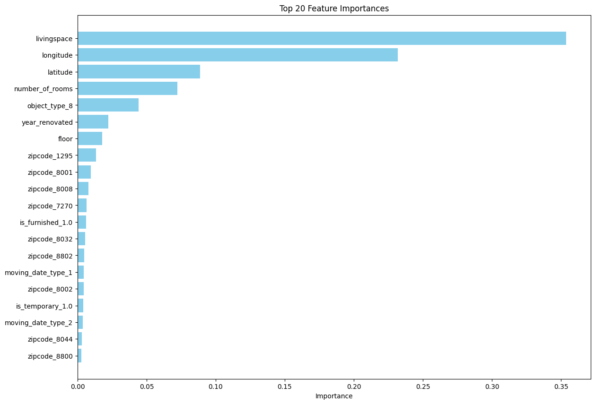

# Modelling Report predicting flat prices with flatfox
The report should summarise the details of the modelling activities, e.g. machine learning experiments. 

## Initial Situation
### Aim of the Modeling:
The primary objective of this modeling task is to develop a predictive model that accurately forecasts the flat prices, consistent with the Data Mining Goals specified in the project charter. This will help users to see if their offer is reasonable, ensuring the project delivers actionable insights and value.

### Data Set(s) and/or Feature Set Used:
- Original Data Source:
  - The initial dataset [flatfox.csv](../preparation/flatfox.csv) was collected from the flatfox api, containing raw and unprocessed data.
  - Processed Data Sets:
    - Cleaned Data Set:
      - After data collection, the dataset was cleaned to remove any irrelevant or noisy data, resulting in a refined version with only relevant data retained. This aligns with the Data Cleaning and Preprocessing Completed milestone.
      - Final Data Set:\
      Further processing involved deleting columns that did not pertain to flats, resulting in a focused dataset containing only relevant features for flats. This was done to ensure that the feature set is aligned with the modeling goals, supporting Feature Engineering Complete.

### Description of the Independent Variables and Target Variable:

- Independent Variables (Features):
  - object_type
  - price_display_type
  - price_unit
  - number_of_rooms
  - floor
  - is_furnished
  - is_temporary
  - zipcode
  - latitude
  - longitude
  - year_renovated
  - moving_date_type
  - reserved
  - livingspace
- Target Variable:
  - price_display

### Type of Model Used or Developed:
            
- Model Type:
  - The type of model being developed is a Decision Tree.
- Algorithm and Parameters:
  - The initial model development and training are carried out using the Random Forest with the parameters listed in Independent Variables.

## Model Descriptions

Overview of the models used and/or implemented and their configurations:

1. **Detailed Description of the Model Used**:
   - **Model Type**: Random Forest with XGBoost
   - **Software Library**: 
     - We used the XGBoost library, which is an optimized distributed gradient boosting library designed to be highly efficient, flexible, and portable.
   - **Implementation Details**: 
     - **XGBoost Version**
     - **Environment**: The model was implemented using Python in a Jupyter Notebook.
   - **Literature References**:
     - Chen, T., & Guestrin, C. (2016). XGBoost: A scalable tree boosting system. In Proceedings of the 22nd ACM SIGKDD International Conference on Knowledge Discovery and Data Mining (pp. 785-794).
     - Additional references as applicable.

2. **Graphical Representation of the Modelling Pipeline**:
3. 


3. **Link to the Code of the Modelling Pipeline**:
   - **Repository**: [Link to the GitHub repository](https://github.com/wipflu1/daai-gg-flatfox/tree/clean-up)

4. **Link to the Literature in which the Model/Method is Described**:
   - **Primary Literature**: 
     - Chen, T., & Guestrin, C. (2016). XGBoost: A scalable tree boosting system. [Link to paper](https://dl.acm.org/doi/10.1145/2939672.2939785)
   - **Supplementary Literature**: 
     - [Any additional relevant literature]

5. **Hyperparameters**:
   - The following hyperparameters were used for the Random Forest with XGBoost model:
```json
{
    "model__colsample_bytree": 0.8,
    "model__learning_rate": 0.1,
    "model__max_depth": 7,
    "model__n_estimators": 400,
    "model__subsample": 0.7
}
```
   - These hyperparameters were tuned using a grid search (or specify other methods if used) to optimize the model performance.


## Results
Key figures dependent on the model and modelling objective

- RMSE: 500.5340168335231
- r2 score: 0.7860227035490116

## Model Interpretation
- We had some insights in the feature importance:

- The modeling objectives as defined in the project charta were mostly achieved

## Conclusions and next steps
- It is possible to make reasonable decisions based on the model
- It makes wildly wrong predictions if the livingspace is missing
- Image analysis, Sentiment analysis or location data from google maps could be used to further the accuracy of the model.
- The images could be used to guess the livingspace for buildings that don't have it listed.