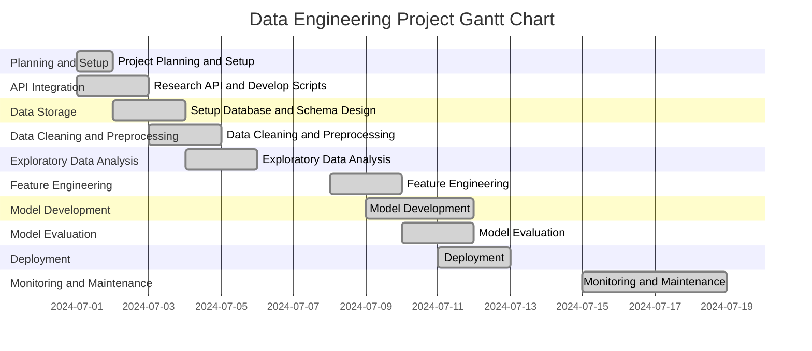

# `Project Outline for Predicting Flat Prices` - Project Charta
## Problem Definition
The housing brokerage market in Switzerland is highly competitive. Flatfox AG aims to maintain its competitive edge by enhancing its product offerings. 
Currently, Flatfox.ch does not have a feature to check the prices of housing listings, leaving users without the tools to estimate fair flat prices. 
Although the platform is popular for listing flats, the lack of this feature poses a significant challenge.

## Situation Assessment
Several of Flatfox's competitors already offer tools for checking flat prices, providing their users with valuable insights and enhancing their overall experience. 
By developing a similar tool, Flatfox.ch has a significant opportunity to improve user experience and build greater trust among its users. 
This strategic enhancement will not only position Flatfox.ch as a more reliable and user-friendly option but also help differentiate it from competitors, attracting more users to the platform and strengthening its market position.

## Project Goals and Success Criteria
The goal of this project is to develop a predictive model to estimate the price of flats listed on Flatfox.ch based on parameters like the number of rooms, location, and living space.
This will help users make informed decisions and avoid overpaying for their desired properties.
We aim to provide customers with accurate price estimates for flats based on their desired features. 
This tool will help customers avoid overpaying during their apartment search, ensuring they make informed decisions and get fair deals on their chosen properties.
Our project will enhance the customers decision process by providing price comparisons, giving customers the confidence that they are making the best possible choice within their budget.

Our project can also be repurposed to benefit flat owners, ensuring they receive the right amount of money from their investments. 
By utilizing our accurate price estimation tool, owners can gauge the true market value of their properties based on location, size, amenities, and current market trends. 
This data-driven approach allows them to set competitive and fair prices, attract potential buyers or renters, and maximize their returns. Additionally, the platform can offer insights into market fluctuations and optimal listing times, helping owners make informed decisions to enhance their investment outcomes.

## Data Mining Goals
Here we define the milestones for the Project. 
- Data Collection Complete
- Data Cleaning and Preprocessing Completed
- Feature Engineering Complete
- Initial Model Development and Training
- Model Evaluation and Refinement
- Deployment
- Final Documentation and Project Report

root mean square deviation (money)
y data profiling 

Along with the definition of the actual technical problem (category) to be solved, 
the project goals must be mapped onto quitable quantitative metrics and corresponding target values. For example, for a classification task one might specify an *F-score* of 0.9 as a minimal requirement for an acceptable solution.  
Such a requirement should be aligned with the overall project goals and/or literature references or justified by other references, respectively.

## Project Plan
In this project, we will scrape data from the Flatfox.ch website to train a model that predicts flat prices based on parameters like the number of rooms, location, and living space. The process includes:
- Data Scraping: Extract detailed information about flat listings from Flatfox.ch.
- Data Preprocessing: Clean and preprocess the data to handle missing values and normalize features.
- Model Training: Use machine learning algorithms methods to build a predictive model.
- Model Evaluation: Assess the model's performance using relevant metrics to ensure accuracy and reliability.

The goal is to create a tool that helps users estimate flat prices on Flatfox.ch, aiding in their decision-making process.

## Roles and Contact Details
Authors:

Lead Bullshitter:            
Liam Decaster -  [decaslia@students.zhaw.ch]()

Head of getting stuff done:  
Lukas Wipf  -    [wipflu1@students.zhaw.ch]()

Yes:            
Grant Gordon -  [gordongr@mail.gvsu.edu]()
