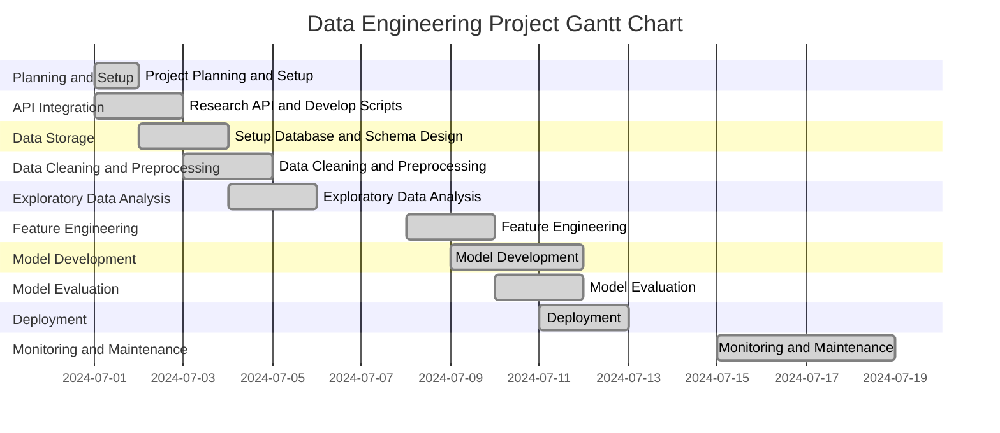

# `Project Outline for Predicting Flat Prices` - Project Charta
## Problem Definition
The goal of this project is to develop a predictive model to estimate the price of flats listed on Flatfox.ch based on parameters like the number of rooms, location, and living space.
This will help users make informed decisions and avoid overpaying for their desired properties.

## Situation Assessment
Currently, Flatfox.ch users lack an automated tool to estimate fair flat prices based on specific features.
While the platform is popular for listing flats, the absence of such a tool poses a challenge. Developing this tool presents an opportunity to enhance user experience and trust, positioning Flatfox.ch as a more reliable and user-friendly option compared to competitors.
## Project Goals and Success Criteria
When is the project successful from a client/stakeholder perspective: Formulate (qualitative) objectives, wherever possible, corresponding key metrics and the target values to be achieved within the project.

It is also often helpful to specify what is explicitly excluded from the project objectives (out of scope).

## Data Mining Goals
Map the problem definition, datasets to be used and primary objective onto a data mining task, e.g.:

* Classification
* Regression
* Clustering
* Outlier Detection
* Association rule learning (market basket analysis)
* Recommender System
* Visualisation
* ...

Along with the definition of the actual technical problem (category) to be solved, 
the project goals must be mapped onto quitable quantitative metrics and corresponding target values. For example, for a classification task one might specify an *F-score* of 0.9 as a minimal requirement for an acceptable solution.  
Such a requirement should be aligned with the overall project goals and/or literature references or justified by other references, respectively.

## Project Plan
Divide the project into individual phases, describe them briefly and draw up a preliminary timetable, e.g. as a Gantt chart:

## Roles and Contact Details
List the people involved in the development work here with their role titles, tasks and contact details
