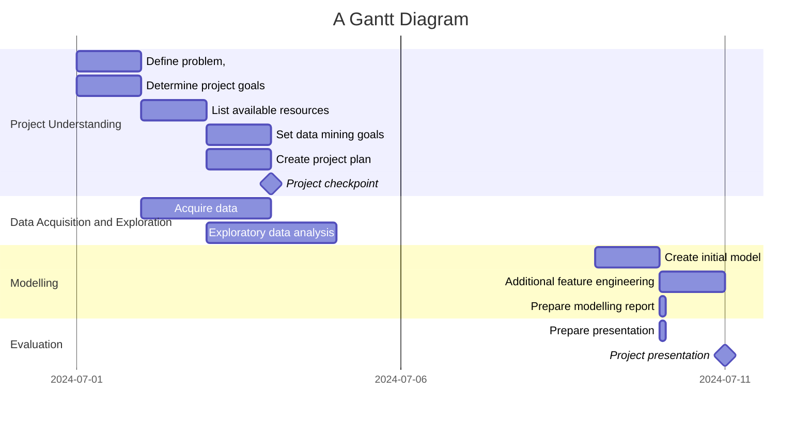

# `Sample Project` - Project Charta
## Problem Definition
Formulate the problem and important information about the domain and/or business area in which the product is to be developed: What exactly is the problem and the expected benefit of the project? Why should we undertake this effort?   
This includes a summary of the most important findings from the user analysis: relevant segments and user groups. Describe the problems and needs of the users of the product to be developed. 

Stakeholders: List the people involved in and affected by the project. Describe their goals and relationships with each other. Visualisation in the form of a stakeholder map can provide a quick overview.

You can reference more detailed analyses such as individual "personas" or interviews in separate documents in the appendix.

## Situation Assessment
Describe the available resources (personnel, material, (software) tools, infrastructure, etc.) and time as well as restrictions and constraints. Possible risks that may arise during the project are also identified.

## Project Goals and Success Criteria
When is the project successful from a client/stakeholder perspective: Formulate (qualitative) objectives, wherever possible, corresponding key metrics and the target values to be achieved within the project.

It is also often helpful to specify what is explicitly excluded from the project objectives (out of scope).

## Data Mining Goals
Map the problem definition, datasets to be used and primary objective onto a data mining task, e.g.:

* Classification
* Regression
* Clustering
* Outlier Detection
* Association rule learning (market basket analysis)
* Recommender System
* Visualisation
* ...

Along with the definition of the actual technical problem (category) to be solved, 
the project goals must be mapped onto quitable quantitative metrics and corresponding target values. For example, for a classification task one might specify an *F-score* of 0.9 as a minimal requirement for an acceptable solution.  
Such a requirement should be aligned with the overall project goals and/or literature references or justified by other references, respectively.

## Project Plan
Divide the project into individual phases, describe them briefly and draw up a preliminary timetable, e.g. as a Gantt chart:

See [Mermaid syntax for Gantt charts](https://mermaid.js.org/syntax/gantt.html).

## Roles and Contact Details
List the people involved in the development work here with their role titles, tasks and contact details
